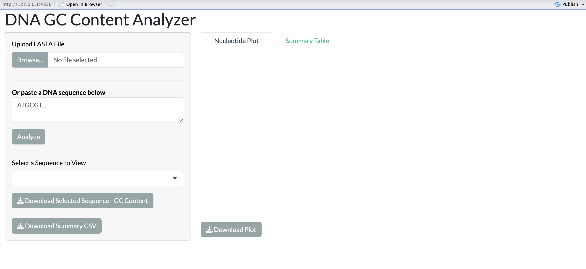
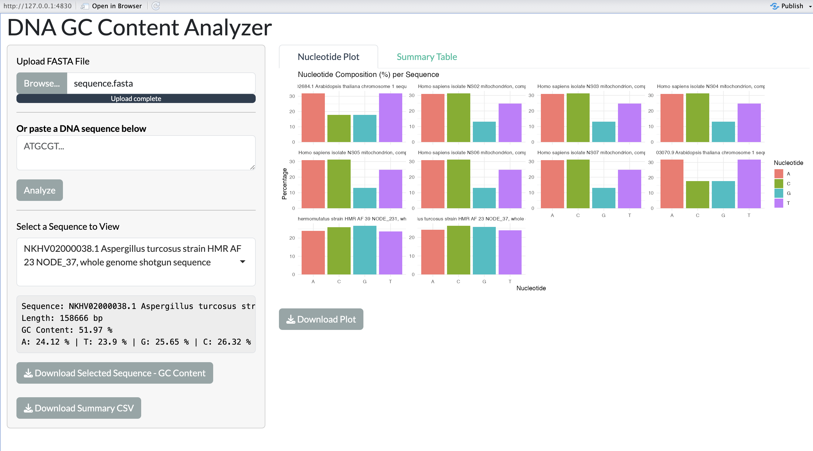
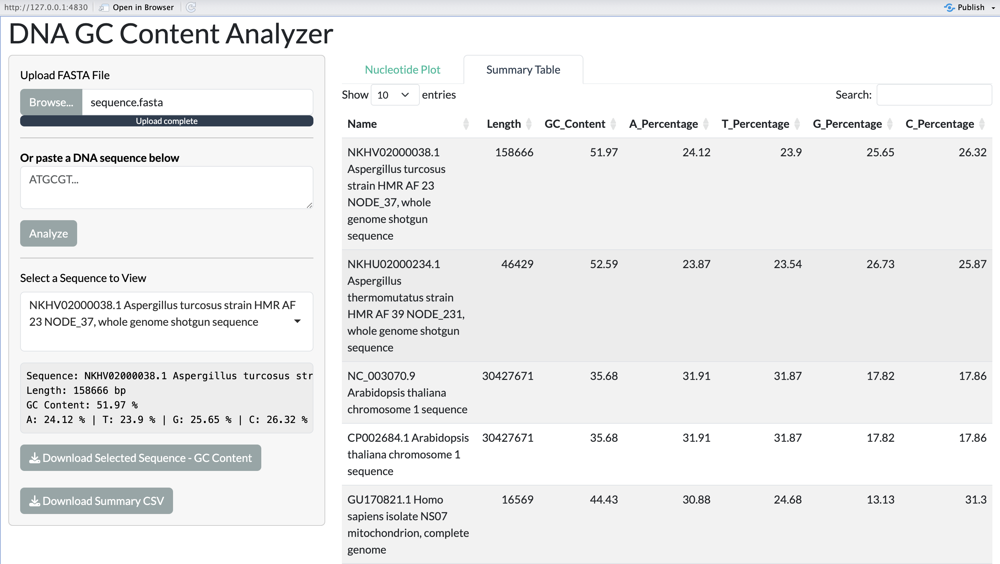

# gc-content-analyzer

A Shiny web application to analyze DNA sequences for GC content and nucleotide composition (A, T, G, C).  
Upload a FASTA file or paste a sequence to instantly visualize and download results.

---

## Features

- Upload multi-sequence FASTA files or paste a DNA string
- Calculate GC content and base percentages for each sequence
- Visualize nucleotide composition via interactive bar plots
- Export summary data to CSV
- Download sequences in FASTA format

---

## App Preview

### 🔹 Main Interface


### 🔹 Nucleotide Composition Plot


### 🔹 Summary Table


---

##  Try It Out

1. Clone the repo or download it as a `.zip`
2. Open `GC_Content_analyser.R` in **RStudio**
3. Run the app with:

   ```r
   shiny::runApp()
   ```

4. Upload a FASTA file or paste a DNA sequence  
5. Explore GC content, view base composition plots, and download results  
6. You can test the app using the included `sequence.fasta` file (tracked via Git LFS)

---

## 📚 Dependencies

```r
# Install Biostrings from Bioconductor
if (!requireNamespace("BiocManager")) install.packages("BiocManager")
BiocManager::install("Biostrings")

# Install required CRAN packages
install.packages(c("shiny", "ggplot2", "DT", "bslib"))
```

---

## 📄 License

MIT License — see [LICENSE](LICENSE)

---

## 👤 Author

**Naga Sai Sarada Priya Mandala**  

If you found this useful, feel free to ⭐ the repo or share it!

---
